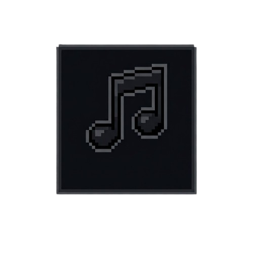
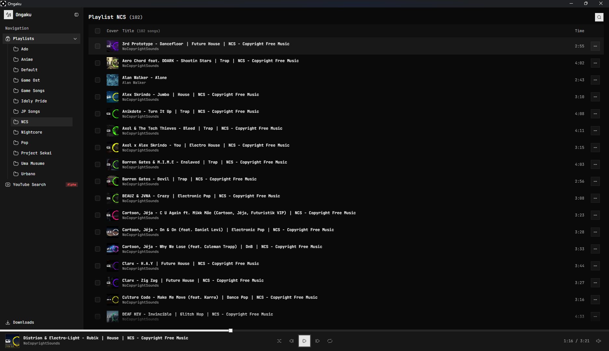
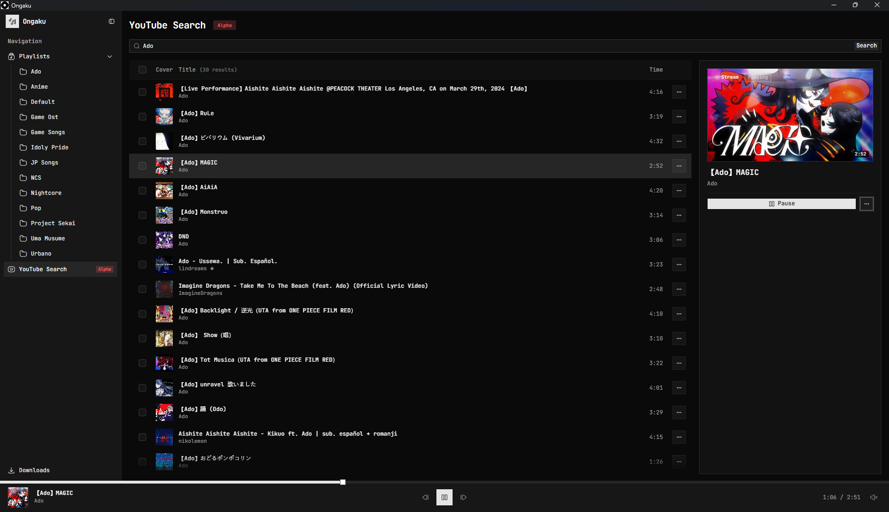
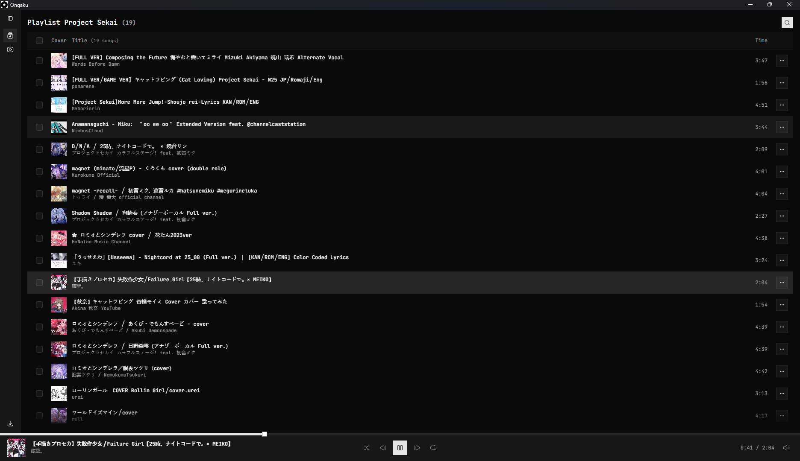

<div align="center">
  
  <h1>Ongaku (音楽)</h1>
  <p>Un reproductor de música de escritorio y descargador de YouTube ligero, minimalista y ultra rápido.</p>

  <p>
    <a href="https://github.com/miguedev1047/ongaku/releases"><b>📥 Descargar Última Versión</b></a>
  </p>

  <p>
    <a href="README.md"><b>English</b></a> •
    <a href="README.es.md"><b>Español</b></a>
  </p>
</div>

---

## 📸 Capturas de Pantalla

<div align="center">
  
  <br/><br/>
  
  <br/><br/>
  
</div>

---

## 📥 Descargas

Obtén el instalador o ejecutable más reciente para tu plataforma directamente desde [GitHub Releases](https://github.com/miguedev1047/ongaku/releases):

- **Windows**: `ongaku_*_x64-setup.exe`
- **macOS**: `ongaku_*_x64.dmg` / `ongaku_*_aarch64.dmg`
- **Linux**: `ongaku_*_amd64.AppImage` / `ongaku_*_amd64.deb`

---

## ✨ Características Destacadas

- 🔍 **Búsqueda en YouTube y Streaming Directo**: Busca pistas directamente dentro de la aplicación y reproduce música en streaming al instante sin necesidad de abrir un navegador web.
- 📥 **Integración con `yt-dlp` y Cola de Descargas Inteligente**:
  - Pool concurrente de descargas con control de límites para evitar bloqueos HTTP 429 de YouTube y picos de CPU.
  - Conversión automática a `.mp3` con carátulas incrustadas y etiquetas ID3 completas.
  - Sanitizador de URLs que limpia automáticamente mixes, colas de radio y parámetros sobrantes.
- 🎛️ **Reproductor de Audio Minimalista**:
  - Diseño simétrico en 3 columnas con barra de progreso (*scrubber*) superior de ancho completo.
  - Control de volumen continuo (0–100%) con aceleración a 60 FPS mediante `requestAnimationFrame` para máxima respuesta sin sobrecargar el renderizado.
  - Atajos de teclado documentados visualmente con badges en tooltips interactivos.
- 📂 **Biblioteca Local y Offline**: Organiza canciones en playlists vinculadas directamente a las carpetas de tu sistema de archivos. Soporte para operaciones por lote (mover, eliminar y descargar en lote).
- ⚡ **Listas Virtualizadas de Alto Rendimiento**: Desarrollado con TanStack Table v9 y renderizado virtualizado para un desplazamiento fluido a 60+ FPS en librerías masivas.
- 🖼️ **Backend Optimizado en Rust**: Servidor local integrado con redimensionado de imágenes por `Lanczos3` y compresión WebP, manteniendo la caché de imágenes en apenas ~16MB.

---

## 💻 Compatibilidad por Plataforma

| Plataforma | Estado | Notas |
| :--- | :---: | :--- |
| **Windows** | ✅ Probado | Funciona de manera óptima. Al no contar con certificado comercial de firma de código, Windows SmartScreen puede mostrar un diálogo de *"Editor desconocido"* (Haz clic en **Más información** &rarr; **Ejecutar de todas formas**). |
| **macOS** | ⚠️ *No Probado* | Binarios `.dmg` precompilados disponibles. Por políticas de seguridad de Gatekeeper, macOS podría bloquear la apertura de apps no firmadas por defecto (`xattr -cr /Applications/Ongaku.app` o clic derecho &rarr; *Abrir*). |
| **Linux** | ⚠️ *No Probado* | Paquetes `.AppImage` y `.deb` precompilados disponibles. Dependiendo de tu distribución, puede ser necesario instalar paquetes del sistema como `webkit2gtk-4.1` y plugins de `gstreamer`. |

---

## 🚀 Comenzando

### Requisitos Previos

- [Bun](https://bun.sh/) (Gestor de paquetes recomendado)
- [Rust](https://www.rust-lang.org/) (Última versión estable mediante `rustup`)
- Herramientas de compilación C++ (Visual Studio Build Tools en Windows)

### Desarrollo

```bash
# Clonar el repositorio
git clone https://github.com/miguedev1047/ongaku.git
cd ongaku

# Instalar dependencias del frontend
bun install

# Iniciar la aplicación en modo desarrollo
bun run tauri dev
```

### Compilación para Producción

```bash
bun run tauri build
```

Los binarios optimizados y el instalador se generarán en la carpeta `src-tauri/target/release/bundle/`.
