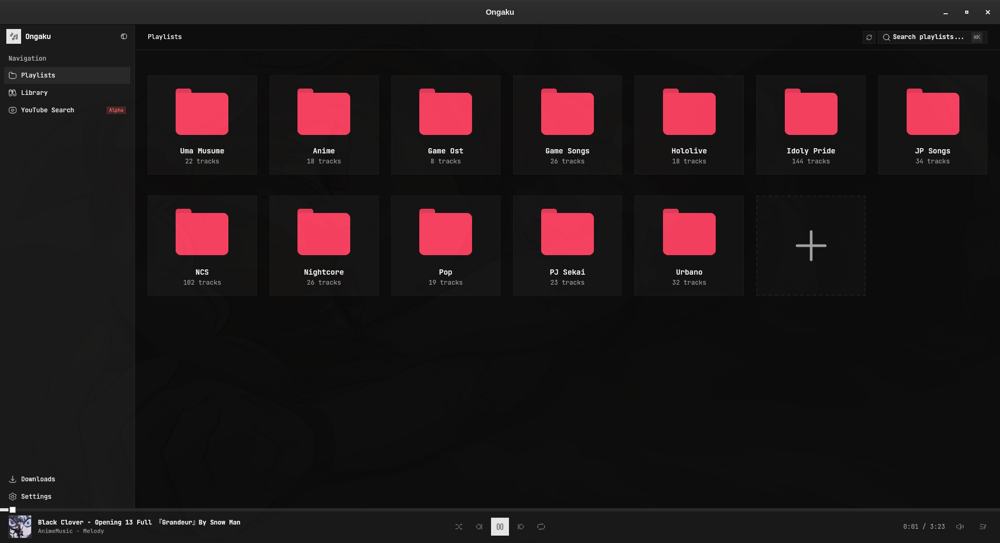
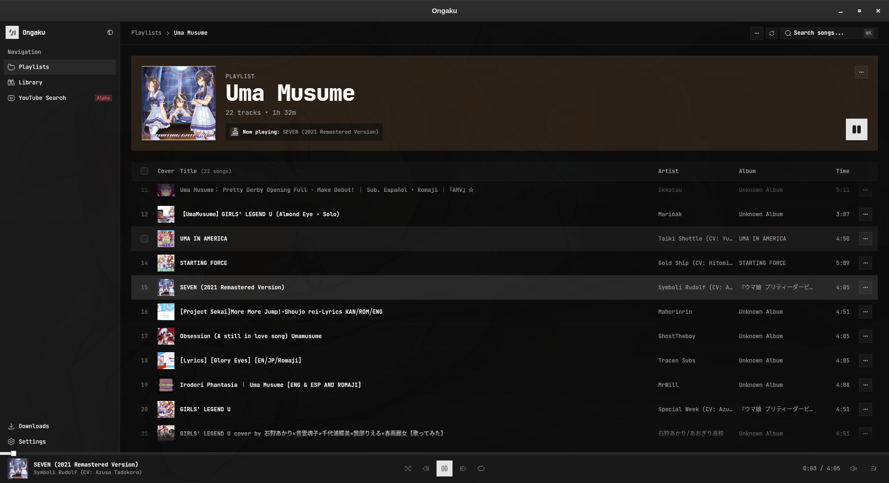
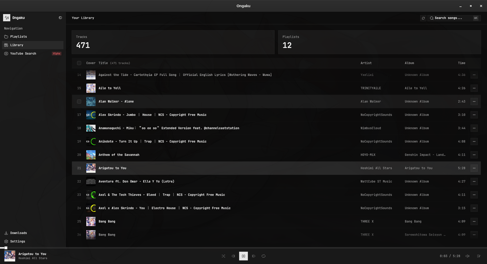

  
  <h1>Ongaku (音楽)</h1>
  
A lightweight, minimal, and blazing-fast desktop music player and YouTube downloader.

  

    <a href="https://github.com/miguedev1047/ongaku/releases"><b>Download Latest Release</b></a> •
    <a href="docs/en/welcome.md"><b>Documentation</b></a>
  

  

    <a href="README.md"><b>English</b></a> •
    <a href="README.es.md"><b>Español</b></a>
  

---

## 📸 Preview

  
    
  
    
  

---

## 📥 Downloads

Get the latest installer or executable for your platform directly from [GitHub Releases](https://github.com/miguedev1047/ongaku/releases):

- **Windows**: `ongaku_*_x64-setup.exe`
- **macOS**: `ongaku_*_x64.dmg` / `ongaku_*_aarch64.dmg`
- **Linux**: `ongaku_*_amd64.AppImage` / `ongaku_*_amd64.deb`

---

## 📖 Documentation

For detailed setup, troubleshooting, complete features, and developer guides:

- [Platform Compatibility & Requirements](docs/en/compatibility.md) _(Windows SmartScreen, macOS Gatekeeper approval, Linux multimedia dependencies)_
- [Complete Documentation & Architecture](docs/en/welcome.md) _(Key features, tech stack, and development setup)_
