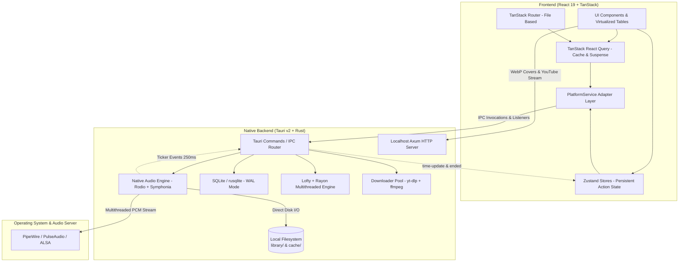

# ⚡ Technical Architecture & Performance Report

This document details Ongaku's internal system architecture, component design, and empirical performance metrics measured in the automated test suite (`src-tauri/tests/performance_tests.rs`).

---

## 🏗️ 1. Overall System Architecture

Ongaku combines a reactive, virtualized frontend with a high-performance Rust backend organized into specialized modules:

---

## 🧩 2. Core Technical Components

### A. Frontend (React 19, TanStack Ecosystem & PlatformService)
- **TanStack Router**: File-based routing (`/playlists/$playlistName`, `/library`, `/settings/`, `/search-youtube`). Route loaders prewarm query caches with `.query()` to guarantee flicker-free transitions.
- **TanStack React Query & Suspense**: Declarative asynchronous state and in-memory caching. The UI relies on `useSuspenseQuery` for system health, audio libraries, and configuration.
- **Zustand Action Stores**: Global state persistence across navigation for long-running workflows (audio download progress, binary installation status, persisted player state).
- **Virtualized Tables**: Powered by TanStack Table / Virtual, rendering only visible DOM elements for smooth 60+ FPS scrolling across thousands of tracks.
- **PlatformService Layer**: Runtime abstraction isolating the React UI from direct Tauri API calls, enabling modularity and seamless cross-platform adaptability.

### B. Native Rust Audio Engine (Rodio, Symphonia & CPAL)
- **Native Decoding and Playback**: Replaced the webview HTML5 `<audio>` element with `rodio` (v0.22) and `symphonia` for local library playback. Completely eliminates WebKitGTK / GStreamer freezes on Linux by offloading audio decoding outside the web browser process.
- **Format Compatibility**: High-fidelity native decoding for `.mp3`, `.flac`, `.wav`, `.ogg` (Vorbis), and `.m4a`/`.mp4` (AAC).
- **Decoupled 60 FPS Seeking**: Dragging the progress slider visually updates the position at 60 FPS (`isSeeking = true`) without CPU overhead; IPC seek commands (`local_audio_seek`) are dispatched to Rust only on pointer release (`onPointerUp`) or discrete ±5s steps.
- **Real-Time Synchronization Ticker**: Dedicated OS background thread (`local-audio-ticker`) polling decoder position every 250ms and emitting `local-player://time-update` and `local-player://ended` events.
- **Strict Mutual Exclusion (YouTube vs Local)**: When playing a remote YouTube stream, `local_audio_stop` immediately terminates Rodio; when playing local audio, the streaming element is instantly cleared, eliminating dual audio playback.
- **Resilience and Circuit Breaker**: Atomic generation tracking (`AtomicU64`) to discard stale playback requests during rapid track switching, automatic circuit breaker (stops after 3 consecutive failures on missing files), and phantom state prevention for cold-deleted persisted tracks.

### C. Local Axum Server & On-Demand Covers
- **Internal HTTP Server**: Binds Axum to `localhost` on a dynamic OS-assigned port to isolate local traffic.
- **On-Demand Cover Processing**: Extract album artwork and downscale via `Lanczos3` with WebP compression on the fly, keeping image cache compact (~16MB).
- **YouTube Stream Delivery**: Efficient bridge for streaming remote YouTube tracks into the webview.

### D. SQLite Database in WAL Mode
- **Relational Integrity**: Normalized schemas (`songs`, `playlists`, `playlist_songs`, `config`).
- **Write-Ahead Logging (WAL)**: Allows concurrent reads without blocking database writes.
- **Indexed Queries**: Fast queries by song ID and positional sorting with dedicated database indexes.

### E. Ingestion Pipeline & Chunked Shield (Lofty + Rayon)
- **Multithreaded Parsing**: `Rayon` balances metadata extraction (ID3v2, Vorbis, FLAC, MP4) across all available CPU cores.
- **Bounded Chunk Processing**: Mass file imports are processed in batches of 100 (`IMPORT_CHUNK_SIZE`), executing safe internal file copies, delta synchronization, and bounded SQLite transactions while emitting live progress events (`import-progress`).

### F. Smart Download Queue (yt-dlp + ffmpeg)
- **Worker Pool**: Queue manager with concurrency limits to prevent CPU throttling and YouTube rate limits (HTTP 429).
- **URL Sanitizer**: Strips extraneous query parameters, playlist queues, and radio mixes to ensure accurate single-track downloads.
- **Atomic Cancellation**: Kills the active subprocess and cleans temporary staging files immediately.

---

## 📊 3. Empirical Benchmarks & Performance Metrics

**Reference Hardware**: AMD Ryzen 5 5600G (6 Cores / 12 Threads @ 3.9 GHz Base / 4.4 GHz Boost, 16 MB L3 Cache).

### A. Lofty Multithreaded Scalability with Rayon
Measures isolated metadata parsing (title, artist, album) across **500 real audio files with FLAC/Vorbis tags**:

| Thread Configuration | Execution Mode | Total Time (500 tracks) | Latency per File | Throughput | Speedup |
| :--- | :--- | :--- | :--- | :--- | :--- |
| **`RAYON_NUM_THREADS=1`** | Single-thread (1 Core) | **`8.95 ms`** | **`17.9 µs`** / track | **~55,900** tracks/s | **`1.00x`** (Baseline) |
| **`RAYON_NUM_THREADS=6`** | 6 Physical Cores | **`2.19 ms`** | **`4.4 µs`** / track | **~228,200** tracks/s | **`4.08x`** faster |
| **`RAYON_NUM_THREADS=12`** | 12 Threads (SMT Enabled) | **`2.03 ms`** | **`4.1 µs`** / track | **~246,500** tracks/s | **`4.41x`** faster |

---

### B. Filesystem, Metadata & Cover Processing

| Operation / Phase | Sample / Volume | Average Latency | Throughput | Technical Details |
| :--- | :--- | :--- | :--- | :--- |
| **Lofty Tags (Rayon 12 threads)** | 500 real audio files | **`4.1 µs`** / file | ~246,500 files/s | Pure parallel parsing with work-stealing scheduling. |
| **Complete Cold Sync** | 100 real audio files | **`4.42 ms`** (total) | ~22,600 files/s | Disk scan + Lofty parse + batch SQLite insertion. |
| **Warm / Delta Sync** | 500 files (no changes) | **`5.39 ms`** (total) | ~92,700 files/s | `mtime` and size verification against DB (0 tag reads). |
| **Cover Extraction + WebP** | 50 JPEG covers | **`6.09 ms`** / cover | ~164 covers/s | Decode + Lanczos3 resize + WebP compression. |

---

### C. SQLite Database (WAL Mode)

| Query / Operation | Data Volume | Average Latency | Throughput | Details |
| :--- | :--- | :--- | :--- | :--- |
| **`get_all_songs`** | 2,000 songs | **`3.45 ms`** | 289 queries/s *(~578,000 songs/s)* | Full library retrieval sorted by `COLLATE NOCASE`. |
| **`get_playlist_songs`** | 200 songs / playlist | **`0.82 ms`** *(820 µs)* | **~1,220 queries/s** | 3-table relational JOIN (`songs` + `playlist_songs` + `playlists`). |
| **`get_playlists`** | 25 playlists | **`1.28 ms`** | ~780 queries/s | Sorted playlist collection retrieval. |
| **`move_song_between_playlists`** | 1 song | **`0.083 ms`** *(83 µs)* | **~12,000 ops/s** | Atomic transaction: playlist re-association & position reindexing. |
| **Initial Bulk Seed** | 2,000 songs + 25 playlists | **`45.49 ms`** | ~44,000 inserts/s | Bulk database population within a single transaction. |
