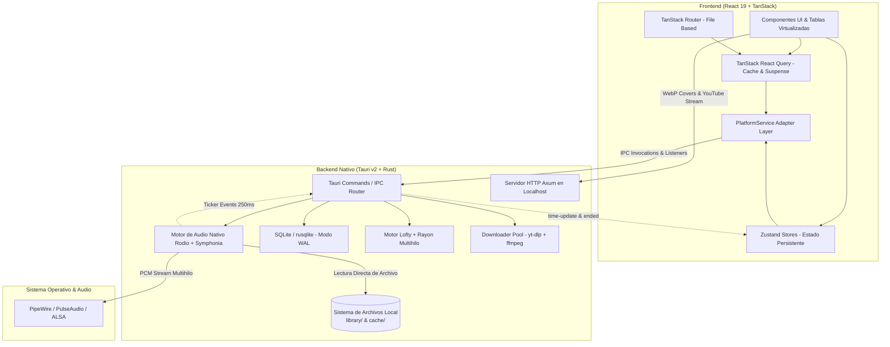

# ⚡ Arquitectura Técnica y Reporte de Rendimiento

Este documento detalla la arquitectura interna del sistema, el diseño de sus componentes y las métricas empíricas de rendimiento obtenidas en los tests automatizados (`src-tauri/tests/performance_tests.rs`).

---

## 🏗️ 1. Arquitectura General del Sistema

Ongaku combina una interfaz reactiva y virtualizada en el frontend con un backend de alto rendimiento en Rust estructurado en módulos especializados:

---

## 🧩 2. Componentes Técnicos Clave

### A. Frontend (React 19, Ecosistema TanStack & PlatformService)
- **TanStack Router**: Enrutamiento estricto basado en archivos (`/playlists/$playlistName`, `/library`, `/settings/`, `/search-youtube`). Los *loaders* de ruta precargan los datos mediante `.query()` para una navegación fluida sin parpadeos.
- **TanStack React Query & Suspense**: Manejo declarativo del estado asíncrono y caché en memoria. La UI utiliza `useSuspenseQuery` para consumir datos precalentados de salud del sistema, bibliotecas y configuración.
- **Zustand Action Stores**: Persistencia del estado global para operaciones largas (progreso de descargas de audio, instalación de binarios y estado del reproductor persistido).
- **Tablas Virtualizadas**: Renderizado virtualizado mediante TanStack Table / Virtual, calculando y montando en el DOM únicamente los elementos visibles en pantalla (manteniendo 60+ FPS estables con miles de canciones).
- **Capa PlatformService**: Abstracción del runtime que desacopla la interfaz React de las llamadas directas de Tauri, facilitando la modularidad y pruebas del frontend.

### B. Motor de Audio Nativo en Rust (Rodio, Symphonia & CPAL)
- **Decodificación y Reproducción Nativa**: Reemplazo completo del elemento HTML5 `<audio>` del WebView por `rodio` (v0.22) y `symphonia` para la biblioteca local. Erradica el 100% de los cuelgues de WebKitGTK / GStreamer en Linux al no procesar audio dentro del motor de renderizado.
- **Compatibilidad de Formatos**: Decodificación nativa de alta fidelidad para `.mp3`, `.flac`, `.wav`, `.ogg` (Vorbis) y `.m4a`/`.mp4` (AAC).
- **Seeking Desacoplado a 60 FPS**: El arrastre del control deslizante actualiza visualmente la posición a 60 FPS (`isSeeking = true`) sin saturar el procesador; el comando `local_audio_seek` se despacha a Rust únicamente al soltar el ratón (`onPointerUp`) o en saltos discretos de ±5s.
- **Ticker de Sincronización en Tiempo Real**: Hilo dedicado del sistema operativo (`local-audio-ticker`) que consulta la posición física del decodificador cada 250ms y emite eventos `local-player://time-update` y `local-player://ended`.
- **Exclusión Mutua Estricta (YouTube vs Local)**: Al reproducir una pista de YouTube en streaming, `local_audio_stop` detiene en seco a Rodio; al reproducir música local, el audio de streaming se limpia inmediatamente, eliminando la reproducción simultánea dual.
- **Blindaje y Resiliencia (Circuit Breaker & Rapid Fire)**: Control de concurrencia atómica (`AtomicU64`) para descartar solicitudes obsoletas en cambios rápidos de pista, disyuntor de seguridad (máximo 3 fallos consecutivos ante archivos ausentes) y prevención de estados fantasma en pistas persistidas.

### C. Servidor Local Axum & Covers On-Demand
- **Servidor HTTP Interno**: Instancia Axum en `localhost` con asignación dinámica de puerto para aislar el tráfico.
- **Procesamiento de Portadas On-Demand**: Extracción y reescalado de carátulas mediante algoritmo `Lanczos3` y compresión WebP al vuelo, optimizando el consumo de memoria caché a ~16MB.
- **Resolución de Streaming de YouTube**: Puente eficiente para la extracción y entrega de streams remotos de YouTube.

### D. Base de Datos SQLite en Modo WAL
- **Transacciones Relacionales**: Tablas normalizadas (`songs`, `playlists`, `playlist_songs`, `config`).
- **Modo WAL (Write-Ahead Logging)**: Permite lecturas simultáneas concurrentes sin bloquear las operaciones de escritura.
- **Consultas Indexadas**: Búsquedas por ID y ordenaciones por posición con índices dedicados.

### E. Pipeline de Ingesta & Blindaje en Chunks (Lofty + Rayon)
- **Procesamiento Multihilo**: `Rayon` distribuye la carga de extracción de metadatos (ID3v2, Vorbis, FLAC, MP4) entre todos los núcleos disponibles de la CPU.
- **Importación Acotada (Bounded Chunks)**: La importación masiva de archivos se divide en lotes de 100 (`IMPORT_CHUNK_SIZE`), realizando copias seguras al directorio interno, sincronización delta y transacciones SQLite acotadas con emisión de eventos de progreso en tiempo real (`import-progress`).

### F. Cola Inteligente de Descargas (yt-dlp + ffmpeg)
- **Pool Concurrente**: Administrador de tareas con control de concurrencia para evitar saturación de CPU y bloqueos por tasa de peticiones (HTTP 429).
- **Sanitización de URLs**: Filtra automáticamente listas de reproducción y radios en vivo para descargar exactamente la pista solicitada.
- **Cancelación Atómica**: Finalización inmediata del subproceso con eliminación de residuos en la carpeta temporal de *staging*.

---

## 📊 3. Benchmarks y Métricas de Rendimiento

**Hardware de referencia**: AMD Ryzen 5 5600G (6 Núcleos / 12 Hilos @ 3.9 GHz Base / 4.4 GHz Boost, 16 MB L3 Cache).

### A. Escalabilidad Multihilo de Lofty con Rayon
Mide el tiempo de parseo aislado de metadatos (título, artista, álbum) sobre **500 archivos de audio reales con tags FLAC/Vorbis**:

| Configuración de Hilos | Tipo de Ejecución | Tiempo Total (500 pistas) | Latencia por Archivo | Throughput | Aceleración (Speedup) |
| :--- | :--- | :--- | :--- | :--- | :--- |
| **`RAYON_NUM_THREADS=1`** | Monohilo (1 Core) | **`8.95 ms`** | **`17.9 µs`** / pista | **~55,900** pistas/s | **`1.00x`** (Línea base) |
| **`RAYON_NUM_THREADS=6`** | 6 Núcleos Físicos | **`2.19 ms`** | **`4.4 µs`** / pista | **~228,200** pistas/s | **`4.08x`** más rápido |
| **`RAYON_NUM_THREADS=12`** | 12 Hilos (SMT Activo) | **`2.03 ms`** | **`4.1 µs`** / pista | **~246,500** pistas/s | **`4.41x`** más rápido |

---

### B. Filesystem, Metadatos y Procesamiento de Portadas

| Operación / Fase | Muestra / Volumen | Latencia Promedio | Throughput | Notas Técnicas |
| :--- | :--- | :--- | :--- | :--- |
| **Lofty Tags (Rayon 12 hilos)** | 500 archivos reales | **`4.1 µs`** / archivo | ~246,500 archivos/s | Parseo puro en paralelo con balanceo de carga *work-stealing*. |
| **Cold Sync Completo** | 100 canciones reales | **`4.42 ms`** (total) | ~22,600 archivos/s | Escaneo de disco + parseo Lofty + inserción batch en SQLite. |
| **Warm / Delta Sync** | 500 archivos (sin cambios) | **`5.39 ms`** (total) | ~92,700 archivos/s | Comparación de `mtime` y tamaño contra DB (0 lecturas de tags). |
| **Extracción + WebP de Cover** | 50 carátulas JPEG | **`6.09 ms`** / cover | ~164 covers/s | Decodificación + reescalado Lanczos3 + compresión WebP. |

---

### C. Base de Datos SQLite (Modo WAL)

| Consulta / Operación | Volumen de Datos | Latencia Promedio | Throughput | Comportamiento |
| :--- | :--- | :--- | :--- | :--- |
| **`get_all_songs`** | 2,000 canciones | **`3.45 ms`** | 289 queries/s *(~578,000 canciones/s)* | Lectura completa y mapeo de biblioteca con orden `COLLATE NOCASE`. |
| **`get_playlist_songs`** | 200 canciones / playlist | **`0.82 ms`** *(820 µs)* | **~1,220 queries/s** | JOIN relacional de 3 tablas (`songs` + `playlist_songs` + `playlists`). |
| **`get_playlists`** | 25 playlists | **`1.28 ms`** | ~780 queries/s | Mapeo y recuperación de todas las playlists ordenadas. |
| **`move_song_between_playlists`** | 1 canción | **`0.083 ms`** *(83 µs)* | **~12,000 ops/s** | Transacción atómica: reasignación de playlist y recálculo de posición. |
| **Bulk Seed Inicial** | 2,000 canciones + 25 playlists | **`45.49 ms`** | ~44,000 inserciones/s | Inserción masiva inicial dentro de una sola transacción. |
